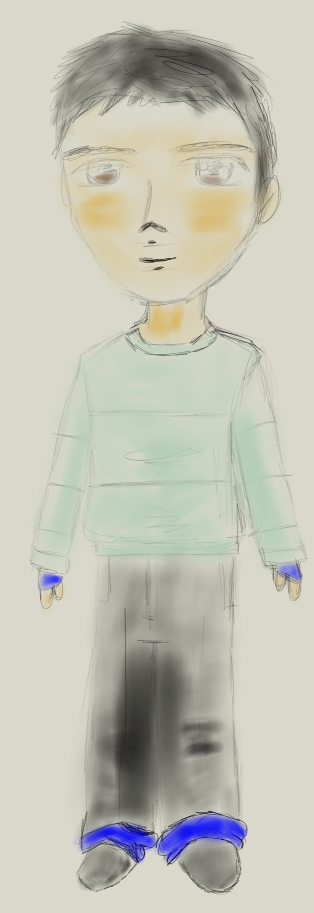

#Plantilla personaje
## 2017-2018
###Mote:
Humanista

###Nombre:
Tomás

###Raza:
Humano

###habilidad principal:
Carga espiritual

####Grupo al que pertenece:
Humanistas/Guardia Real

###Ocupación:  
Profesor

###Estado Civil:  
Casado
 
###Origen, contexto:
Tomás siendo un estudiante promedio llegado del área rural que no presenta aptitudes básicas para ser aceptado ni en la **guardia real** ni en la orden de los **soldados blandos**, su historia inicia cuando se encuentra con **delphos** en la academia militar de WSC y realizan una misión de rescate de una chica, la cual los pone frente al peligro y este logra descubrir su nuevo potencial de justiciero y es recibido por la orden de "**Los Humanistas**" como miembro

###Observaciones:
**Tomás** toma el papel de **profesor** de la **academia militar de WSC** como sucesor de la orden de "**Los Humanistas**", en los tiempos de "los caídos" / "menos indicado" este se encuentra a cargo del almacén de víveres de la academia.

###Diseño:

####Base:

####Agente (Teacher Mode):

####Gamber (Physic Mode): 

 
####Conde Demonio (Magical Mode):

